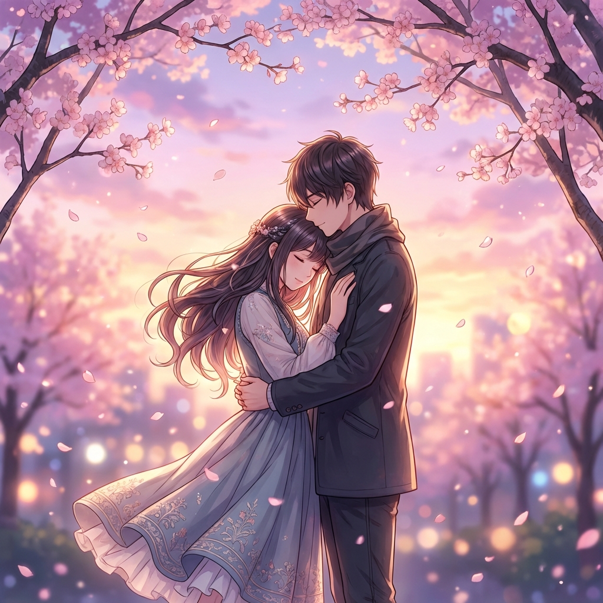

# Forever Yours ❤️ | A Romantic Proposal & Love Journey

A beautiful, interactive, and romantic website designed to celebrate love, capture memories, and pop the big question. This project features a timeline of your relationship, a photo gallery, cherished quotes, and a special interactive proposal section.



## ✨ Features

- **💌 Interactive Proposal**: A special "Will You Marry Me?" section with a "Yes" button that triggers a celebration (confetti, modal) and a playful "No" button that dodges the cursor.
- **⏳ Time Together Counter**: A real-time countdown timer showing exactly how long you've been together (Days, Hours, Minutes, Seconds).
- **📸 Memory Gallery**: A beautiful grid layout to showcase your favorite moments together.
- **💬 Quote Carousel**: A rotating selection of romantic quotes to set the mood.
- **📖 Love Story Timeline**: An interactive journey through your relationship's milestones.
- **💌 Love Letters**: A section for deep, heartfelt messages.
- **✨ Visual Effects**:
  - **Floating Hearts**: Gentle hearts floating in the background.
  - **Particles.js**: subtle particle effects for a magical atmosphere.
  - **Custom Cursor**: A heart-themed cursor with a trailing effect.
  - **AOS & GSAP Animations**: Smooth scroll animations and reveal effects.
  - **Interactive Background**: Reacts to mouse movement.
- **📱 Fully Responsive**: Designed to look perfect on both mobile and desktop devices.

## 🛠️ Technologies Used

- **HTML5**: Semantic markup for structure.
- **CSS3**: Custom styling, gradients, glassmorphism effects (`animations.css`, `style.css`).
- **JavaScript (ES6+)**: Interactive logic, custom animations (`script.js`, `shared.js`, `advanced.js`).
- **Bootstrap 5**: Responsive grid and components.
- **Libraries**:
  - [AOS (Animate On Scroll)](https://michalsnik.github.io/aos/): For scroll animations.
  - [GSAP (GreenSock Animation Platform)](https://greensock.com/gsap/): For complex animations.
  - [Particles.js](https://vincentgarreau.com/particles.js/): For background particle effects.
  - [Canvas Confetti](https://www.kirilv.com/canvas-confetti/): For the celebration effect.
  - [Font Awesome](https://fontawesome.com/): For icons.

## 🚀 Getting Started

### Prerequisites

You just need a modern web browser to view this website. No special software is required.

### Installation

1.  **Clone the repository:**
    ```bash
    git clone https://github.com/your-username/forever-yours.git
    ```
2.  **Navigate to the project directory:**
    ```bash
    cd forever-yours
    ```
3.  **Open `index.html`:**
    Double-click on `index.html` to open it in your default web browser.

## 📂 Project Structure

```
├── index.html          # Main landing page (Home)
├── proposal.html       # The Proposal page with interactive buttons
├── birthday.html       # Birthday celebration page
├── gallery.html        # Photo gallery page
├── quotes.html         # Romantic quotes collection
├── story.html          # Story/Experience page
├── style.css           # Main stylesheet
├── animations.css      # Custom animations
├── script.js           # Main landing page logic
├── shared.js           # Shared logic (navbar, hearts, etc.)
├── advanced.js         # Advanced effects (cursor, tilt, etc.)
└── couple.png          # Main hero image
```

## 🎨 Customization

- **Update Start Date**: Open `index.html` and modify the `startDate` variable in the script section to your anniversary date.
- **Change Images**: Replace `couple.png` and update image links in `gallery.html`.
- **Modify Quotes**: Edit the `quotes` array in `index.html` to add your favorite sayings.
- **Personalize Messages**: Update the text in `proposal.html` and other pages to tell your unique story.

## 💝 Contributing

Feel free to fork this project and use it to propose to your loved one! If you have ideas to make it even more romantic, pull requests are welcome.

## 📄 License

This project is open source and available under the [MIT License](LICENSE).

---

<p align="center">
  Made with ❤️ for the Love of My Life
</p>
